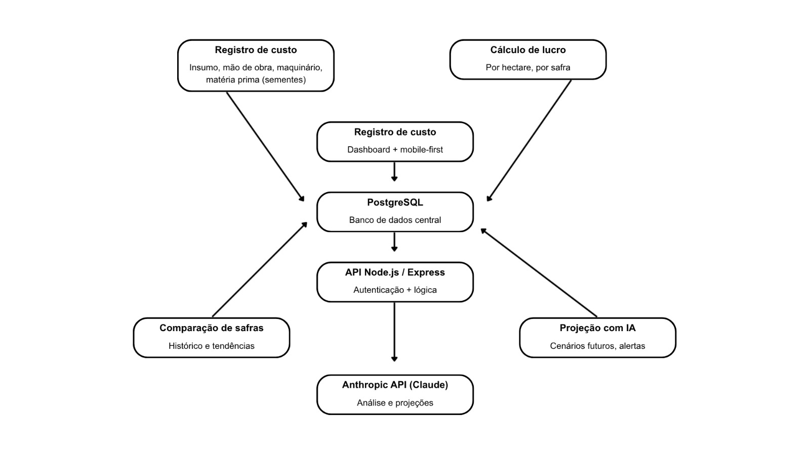

# 02-CODIGODEGUERRA
Bruna Gabrielli - Relatora Administrativa;
Guilherme William - Negócios;
Luís Eduardo - Programador;
Letícia Santos - Representante e designer;
Letícia Braz - designer;

Escopo do Projeto: (Negócios)
Safra+
Plataforma de Inteligência Financeira para Agricultores Familiares
Slogan
"A Safra+ não foi criada para registrar o passado. Foi criada para projetar o futuro da safra."

Problema
Milhares de agricultores familiares tomam decisões financeiras importantes sem saber qual será sua margem de lucro antes da safra.
Apesar de registrarem custos e acompanharem sua produção, muitos não possuem ferramentas capazes de transformar essas informações em previsões financeiras que auxiliem a tomada de decisão.

Solução
A Safra+ é uma plataforma de inteligência financeira que permite aos agricultores familiares:
Registrar custos de produção;
Calcular lucro por hectare;
Comparar safras anteriores;
Projetar cenários financeiros futuros;
Antecipar a rentabilidade da próxima safra.

Diferencial Competitivo
A Safra+ não é um sistema de controle.
A Safra+ é um sistema de decisão.
Enquanto os sistemas tradicionais mostram o que aconteceu, a Safra+ mostra o que provavelmente acontecerá.
Nosso objetivo é fornecer previsibilidade financeira antes que o produtor tome decisões de investimento.

Público-Alvo
Público Principal
Agricultores familiares produtores de:
Soja
Milho
Trigo
Arroz
Perfil
Gestão financeira simplificada;
Utilização de planilhas ou cadernos;
Pouco acesso a ferramentas de inteligência financeira;
Necessidade de aumentar a rentabilidade da propriedade.
Público Secundário
Cooperativas agrícolas;
Consultores agrícolas;
Associações rurais.

Persona
João da Silva
47 anos;
Agricultor familiar;
Produtor de soja e milho;
150 hectares;
Utiliza Excel e anotações em caderno;
Investe mais de R$ 300.000 por safra.
Principais dores
Não conhece sua margem futura;
Não possui previsibilidade financeira;
Tem dificuldade para avaliar a rentabilidade da safra antes do plantio.

Concorrentes
Aegro
Principais funcionalidades:
Gestão financeira;
Planejamento de safra;
Controle de custos;
Rentabilidade por talhão;
Comparação entre planejado e realizado.
Climate FieldView
Principais funcionalidades:
Agricultura digital;
Monitoramento da lavoura;
Integração de dados;
Apoio à tomada de decisão.
Nossa vantagem competitiva
Concorrentes
Safra+
Gestão financeira
Inteligência financeira
Controle do passado
Projeção do futuro
Público amplo
Agricultura familiar
Sistemas complexos
Simplicidade e acessibilidade

Modelo de Negócio
A Safra+ utiliza o modelo SaaS (Software as a Service).
Safra+ Free
R$ 0/mês
Recursos
Cadastro da propriedade;
Controle básico de custos;
Dashboard simples;
Registro de safras.
Objetivo:
Atrair produtores para dentro da plataforma.

Safra+ Pro
R$ 79/mês
Recursos
Tudo do plano gratuito;
Projeção de lucro;
Comparação de safras;
Simulação de cenários;
Relatórios avançados;
Indicadores de rentabilidade.

Safra+ Enterprise
Sob consulta
Recursos
Gestão de múltiplos produtores;
Painéis consolidados;
Relatórios gerenciais;
Suporte dedicado.

Estratégia de Crescimento
O produtor entra gratuitamente.
Registra seus custos.
Percebe valor na plataforma.
Necessita projeções financeiras.
Migra para o plano Pro.

Mercado
Mercado Inicial
Produtores de grãos do Rio Grande do Sul.
Expansão Regional
Região Sul do Brasil.
Escala Nacional
Produtores de soja, milho, trigo e arroz em todo o Brasil.

Mercado Potencial
Mais de 10,1 milhões de pessoas trabalham na agricultura familiar brasileira.
A Safra+ nasce para democratizar o acesso à inteligência financeira no campo.

Receita Projetada
Plano Pro: R$ 79/mês (R$ 948/ano)
Adoção
Usuários
Receita Anual
0,1%
10.100
R$ 9,6 milhões
0,5%
50.500
R$ 47,9 milhões
1%
101.000
R$ 95,7 milhões
5%
505.000
R$ 478,7 milhões

MVP
Versão inicial da plataforma:
Cadastro da propriedade;
Cadastro de custos;
Dashboard financeiro;
Comparação de safras;
Projeção básica de lucro.

Investimento Inicial
Valor necessário:
R$ 30.000
Destinação dos Recursos
Desenvolvimento
R$ 15.000
Infraestrutura e Hospedagem
R$ 3.000
Marketing e Validação
R$ 7.000
Reserva Operacional
R$ 5.000

Despesas Mensais
Categoria
Valor
Servidores e Banco de Dados
R$ 500
Manutenção da Plataforma
R$ 1.500
Marketing Digital
R$ 2.000
Suporte e Operação
R$ 1.000
Total
R$ 5.000

Missão
Democratizar o acesso à inteligência financeira para agricultores familiares, permitindo decisões mais seguras e lucrativas.

Visão
Tornar-se a principal plataforma de inteligência financeira para agricultores familiares do Brasil.

Valores
Simplicidade;
Transparência;
Inovação;
Sustentabilidade;
Valorização do produtor rural.

